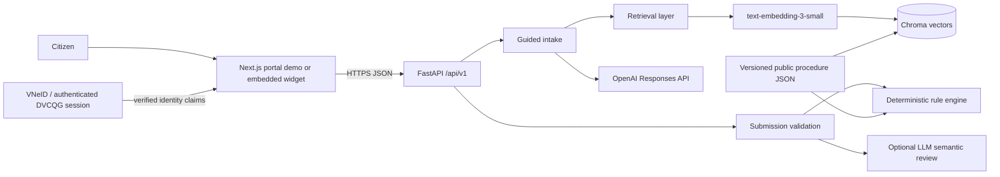

# GovEase-AI System Architecture

GovEase-AI is a monorepo containing two independently deployed applications: a FastAPI backend on Render and a citizen-facing Next.js demo/widget on Vercel. They communicate only through the versioned REST API, so the frontend can be moved into an existing public-service portal without coupling it to the backend deployment.

## Main components

- `backend/app/api`: versioned HTTP routes, request IDs and stable errors.
- `backend/app/services`: orchestration and frontend-facing procedure schemas.
- `backend/app/rag`: Chroma retrieval using OpenAI embeddings.
- `govease_ai`: procedure loading, chunking, intake and two-layer validation.
- `data`: source-derived structured procedure records and evaluation fixtures.
- `frontend`: independently deployable Next.js portal simulation and iframe widget.

## Models and APIs

- Embedding: `text-embedding-3-small`.
- Generation: configurable Codex model through the OpenAI Responses API.
- Primary API: `/api/v1`; legacy `/api` routes remain temporarily compatible.
- Storage: versioned persistent Chroma collections promoted through an atomic `index_manifest.json`.

## Trust boundaries

Deterministic errors are authoritative and cannot be removed by the LLM layer. Generated guidance is grounded in retrieved chunks and includes source URLs. The application calls the OpenAI embeddings endpoint itself and supplies vectors to Chroma, avoiding SDK coupling through a Chroma adapter. If OpenAI is not configured, `/chat` uses the deterministic retrieval response while catalog, intake and validation remain available.

Identity-number fields are not enriched or reverse-engineered by GovEase. In the target portal integration they are supplied as verified claims from the authenticated VNeID/DVCQG session. The standalone demo permits manual values only to demonstrate validation and never checks non-public prefix semantics.
